# LiberateDNA - DNA Reader

**Explore your DNA without sharing it.**

LiberateDNA reads your raw DNA file right in your web browser and shows your heritage,
health, traits and drug response. Your file never leaves your machine.

**[Open LiberateDNA](https://njarrar.github.io/LiberateDNA/)** · Version 3.1.0 · English, العربية, Français

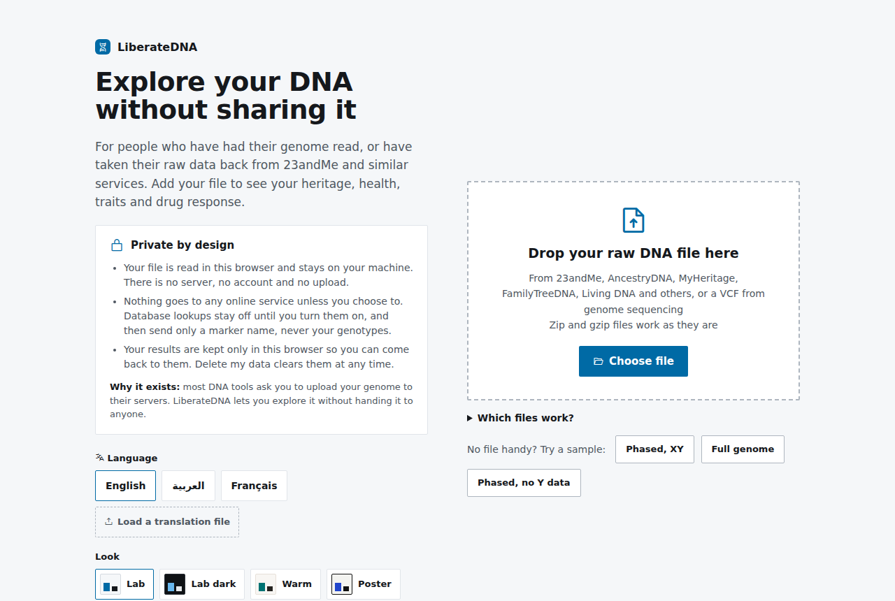

## Why it exists

Most DNA tools ask you to upload your genome to their servers before they show you
anything. Once it is there, you no longer control who keeps it or what they do with it.

LiberateDNA is for people who have had their genome read, or who have taken their raw data
back from 23andMe and similar services, and want to explore it without handing it to
anyone else.

## Your data stays private

- **No upload.** The whole app is one HTML file. Your file is opened and read by your
  browser, on your machine. There is no server behind it, no account and no sign-in.
- **No sharing unless you choose.** Nothing goes to any online service on its own. If you
  want more detail on a marker, you can turn on public database lookups (MyVariant,
  Ensembl, SNPedia and others). They stay off until you switch them on, and even then
  they send only the marker name, such as `rs4988235`, never your genotypes.
- **You stay in control.** Your results are kept only in this browser's own storage, so
  you can come back to them. **Delete my data** clears them with one click.
- **Works offline.** Download `index.html` and open it with no internet at all. The only
  outside request is for web fonts, and the app falls back to system fonts without them.
- **Open source.** Every line is in this repository under the MIT license, so anyone can
  check what it does.

## What's new in 3.1.0

- **Languages.** LiberateDNA now speaks English, Arabic and French. Pick one on the home page,
  in the sidebar or in the menu; the choice is remembered on your device. It also follows your
  browser's language on first visit, and `?lang=ar` or `?lang=fr` in the address works too.
- **Right to left.** In Arabic the whole layout mirrors: sidebar on the right, text and
  controls read right to left. Chromosome positions keep their left to right scale.
- **Translations anyone can add.** Each language is a plain XML file in [`lang/`](lang/).
  Copy `en.xml`, translate it and open a pull request. You can test a file first with
  **Load a translation file**, which uses it in your browser only.
- The version and a link to the source now show on the home page.

### 3.0.0

- Heritage worked out from your own file against 36 reference groups, with a map, ranges,
  chromosome painting and deep maternal and paternal lines.
- Renamed to LiberateDNA, with the privacy promise on the home page.

## Languages

| | |
|---|---|
| 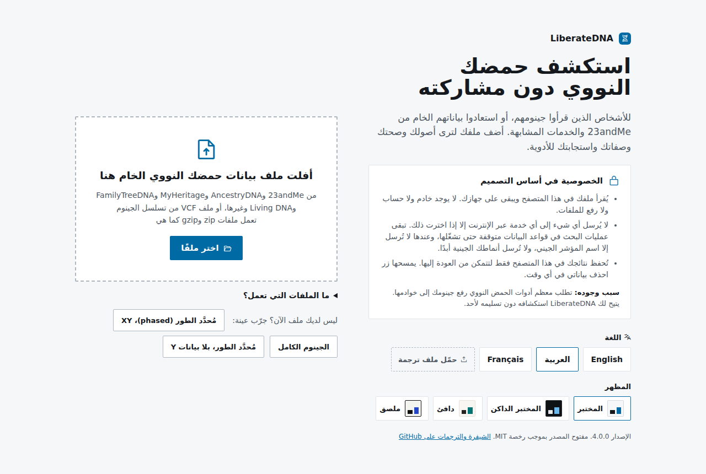 | 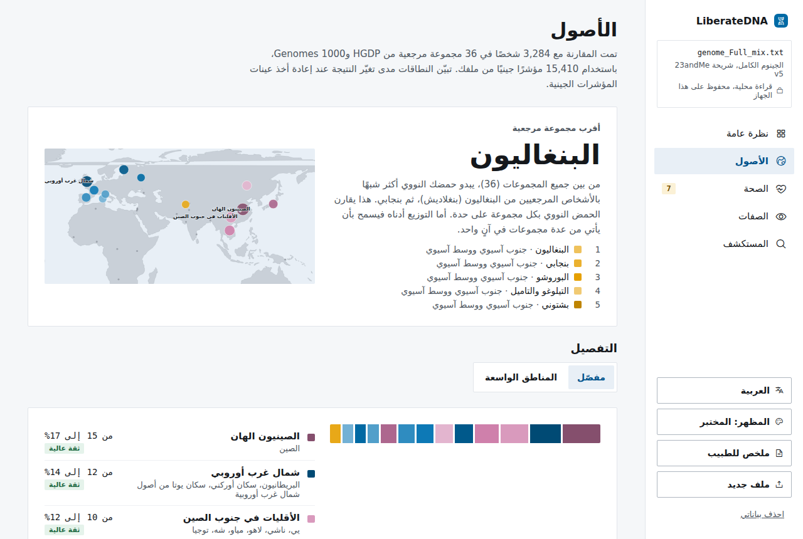 |

All three languages ship inside the one `index.html`, so they work offline too. To add a
language or fix a translation, see [lang/README.md](lang/README.md). Every entry pairs the
English text with its translation:

```xml
<entry>
  <source>Explore your DNA without sharing it</source>
  <translation>استكشف حمضك النووي دون مشاركته</translation>
</entry>
```

Values such as numbers and names appear as `{0}`, `{1}`, so a translation can place them
wherever its grammar needs. Anything left empty falls back to English.

## What it shows

| | |
|---|---|
| 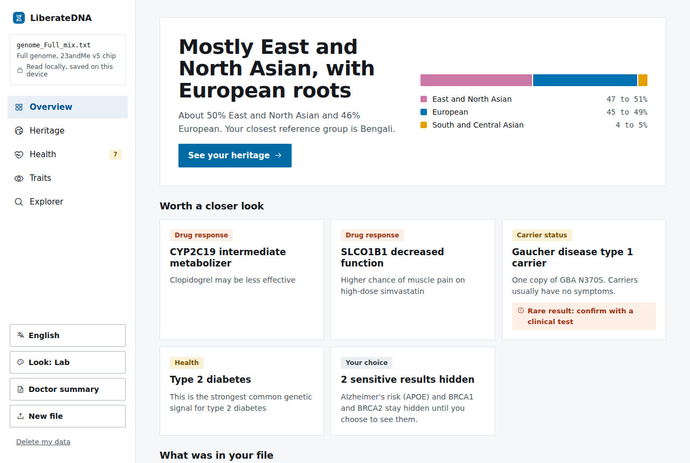 | 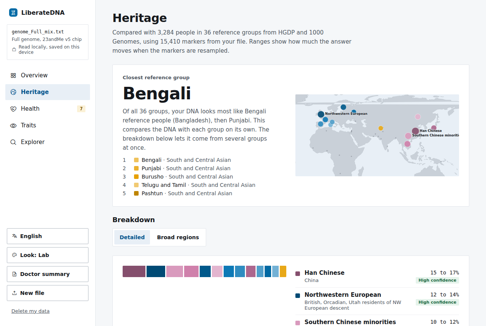 |
| **Overview.** Your broad origins, what deserves a closer look, and a summary of your file. | **Heritage.** Your closest group out of 36 reference groups, a map and a detailed breakdown. |
| 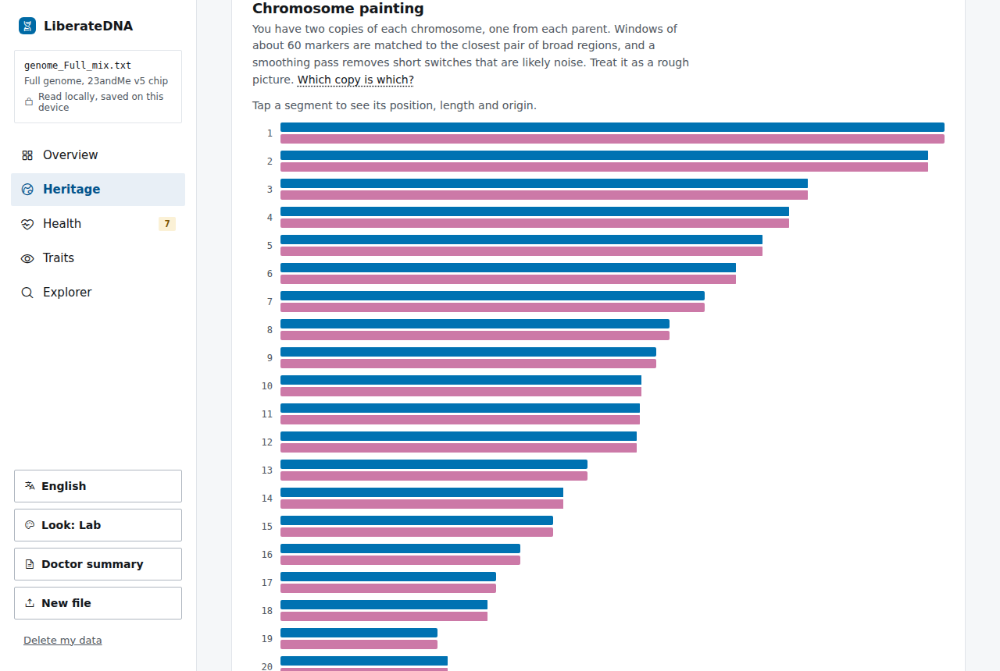 | 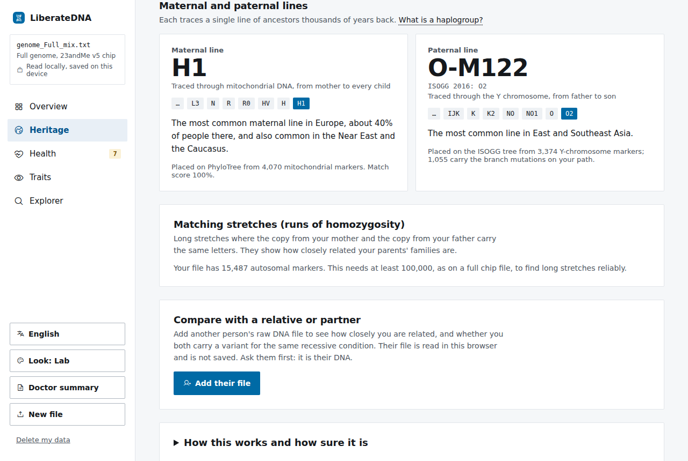 |
| **Chromosome painting.** Where each stretch of your DNA most likely comes from. | **Maternal and paternal lines.** Placed on the full public family trees. |
| 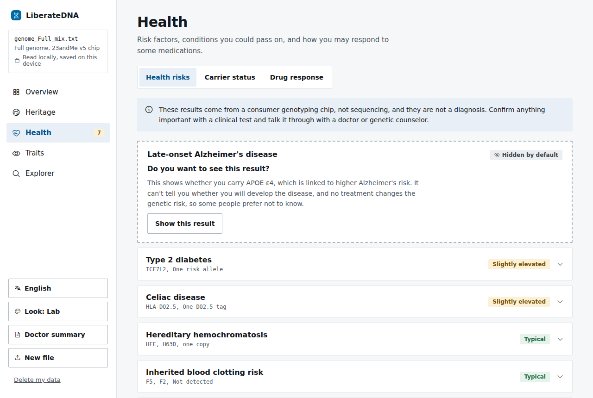 | 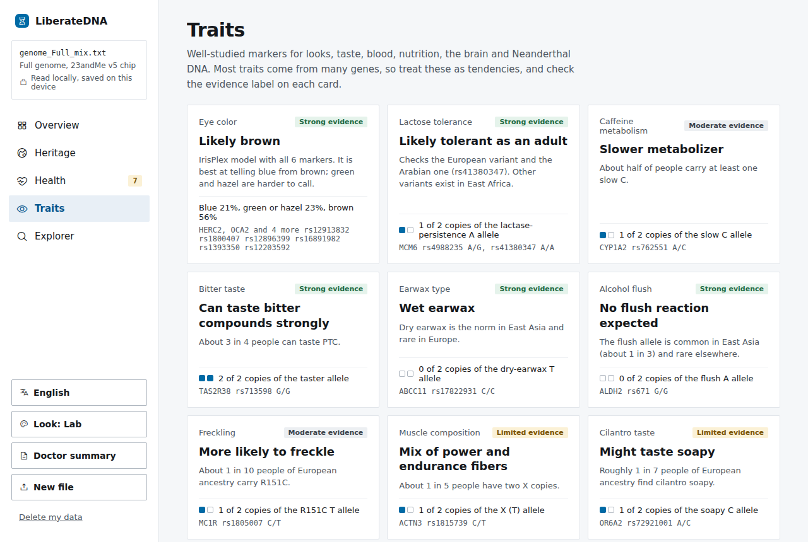 |
| **Health.** Risk factors, carrier status and drug response, with sensitive results hidden until you ask. | **Traits.** Lactose tolerance, caffeine, eye color and more. |

It also has an **Explorer** to search every marker in your file, a **doctor summary** you
can print, four color themes, three languages and a phone layout.

<p align="center">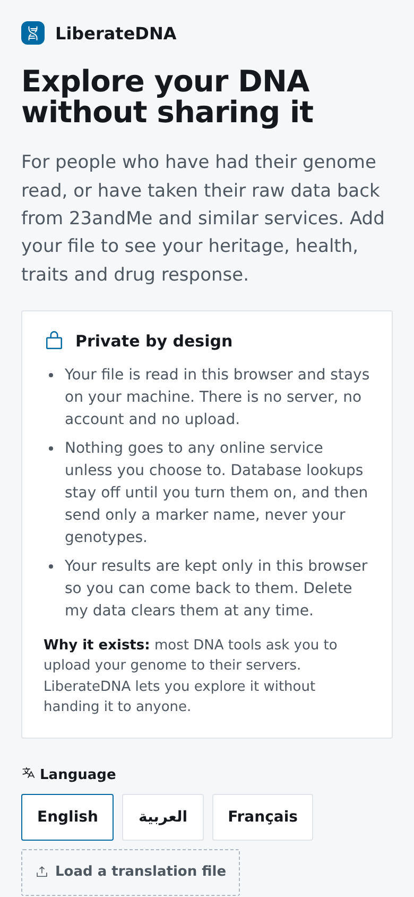 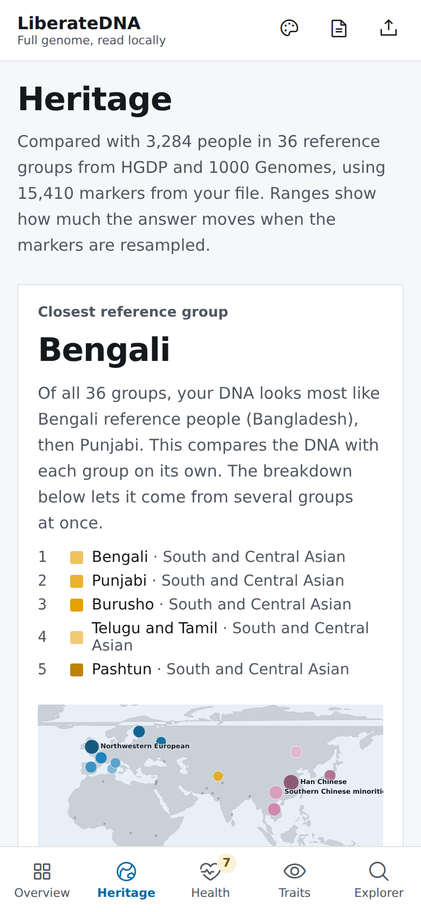</p>

## What it reads

- 23andMe raw data: `genome_Full_*.zip`, `phased_genotype*.zip`, or the `.txt` inside them
- Password-protected zips (standard zip encryption). AES zips must be unzipped first.
- The same table saved as CSV

Files from AncestryDNA, MyHeritage and FamilyTreeDNA are detected and turned away for now,
because their marker sets differ and the results would not be reliable.

These results come from a consumer chip, not a medical test. They are not a diagnosis.
Confirm anything important with a clinical test and a doctor or genetic counselor.

## How heritage works
Everything below runs in your browser, on your file:

- **Closest group and breakdown.** About 15,400 markers that 23andMe chips share with the
  Illumina GSA are compared with 3,284 people in 36 reference groups from the HGDP and
  1000 Genomes projects. A supervised mixture model (as in frappe and ADMIXTURE projection)
  finds the share of each group; ranges come from resampling blocks of markers. Groups under
  2% are dropped, since they mostly soak up noise.
- **Chromosome painting.** Windows of about 120 markers are matched to the closest pair of
  broad regions, with a light pull toward the overall result. It is a rough picture.
- **Maternal line.** Placed on PhyloTree Build 17 (5,400+ branches) with the HaploGrep
  scoring method, from the mitochondrial calls in the file.
- **Paternal line.** Placed on the ISOGG 2016 Y tree (1,800+ branches, 15,000 SNPs) by the
  best supported path, for files with a Y chromosome.

Tested on 108 people held out of the reference: the top group was right for 78% and the top
region for 96%. Pairs it confuses most: Baloch and Brahui with Makrani, French with
Northwestern European, Finnish with Eastern European.

Limits: open data has no reference groups for the Gulf, Iraq, Iran, Turkey, Egypt or Yemen.
Ancestry from those places shows up split across the nearest groups (Bedouin, Palestinian,
Druze, Circassian, Pathan and others).

### Data sources and credits
- HGDP and 1000 Genomes genotypes, read from the gnomAD v3.1.2 HGDP+1KG release
  (public, Google Cloud). Bergström et al. 2020; 1000 Genomes Project 2015; Koenig et al. 2024.
- Illumina GSA marker list (rsid and GRCh37 position maps), lifted to GRCh38 with the UCSC
  chain file.
- PhyloTree Build 17, van Oven 2016, via github.com/genepi/phylotree-rcrs-17 (MIT).
- ISOGG Y-DNA Haplogroup Tree 2016, as shipped in github.com/23andMe/yhaplo. Only the
  tree and SNP table are used; no yhaplo code is included.
- World outline: Natural Earth via world-atlas (ISC).

### Rebuilding the reference data
`anc/` holds the scripts. In that folder, with pysam, pyliftover and the files above:
`cand.py` picks candidate markers, `fetch.py` reads their genotypes from gnomAD by range
request, `mtbuild.py` and `ybuild.py` build the two trees. Then `python3 src/refbuild.py`
writes `src/ref.js` and `node src/refcheck.js` scores the held-out people and stores the
figures shown in the app.

## Preview options (URL parameters)
- `?lang=en|ar|fr`
- `?theme=lab|dark|warm|poster`
- `?start=upload|dashboard`
- `?tab=overview|heritage|health|traits|explorer` and `?sub=risks|carrier|drugs`
- `?sample=phased|full|xx`
- `?demo=password|vendor|corrupt|oldchip|slow|lookupfail|offline`
- `?layout=desktop|mobile`

## Building from source
`src/` holds the parts. `python3 src/build.py index.html` rebuilds the single file, bundling
every language in `lang/`; it
expects Preact + htm (`htm/preact/standalone.umd.js`) and `@phosphor-icons/web` 2.1.1
unpacked in a `deps/` folder next to `src/`.

## Tests
`tests/` holds Playwright scripts and sample files (a normal zip, a phased zip, a zip with password `hunter2`, an AncestryDNA export, a cut-off file and an empty file). `tests/files/make_me.py` builds three more: a Middle Eastern style male file (J1 lines, Arabian lactase variant, G6PD, an i-number duplicate), the same as CSV, and a female file whose Y rows are single-dash no-calls. `genome_Full_her.txt` is a held-out Palestinian man from the reference build, used to check the Heritage page; `node tests/fixtest.js` checks them. Serve the folder (`python3 -m http.server 8765`), then run `node tests/realtest.js` from inside `tests/` with Playwright installed. `node tests/i18ntest.js` checks language switching, the right to left layout and that no translated text is left in English; `LANGS=en,ar,fr node tests/sweep.js` checks every theme and language at desktop and phone widths.

## License

MIT, see [LICENSE](LICENSE). The reference data in `src/ref.js` comes from the public
sources listed above, which keep their own terms.
